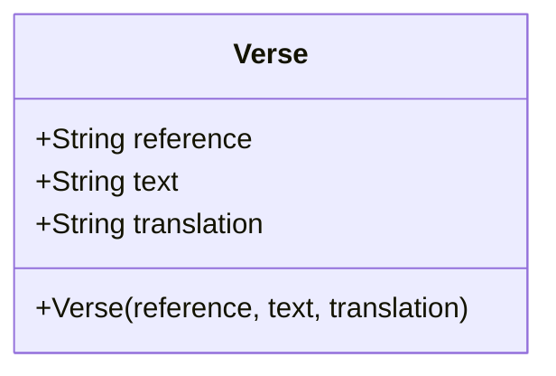

# Design Document: `reference_learning` Package

## 1. Overview

The `reference_learning` package is a Flutter library designed to assist users in memorizing scripture references. It presents a scripture verse's text and prompts the user to input its corresponding reference. The package aims to provide a simple, interactive, and testable core for this learning process, emphasizing clear separation of concerns and a straightforward architecture suitable for an MVP.

## 2. Detailed Analysis of the Goal or Problem

Many individuals desire to memorize scripture verses and their associated references. The traditional method often involves flashcards or rote memorization, which can be inefficient or unengaging. This package addresses the need for an interactive tool that facilitates this process.

The core problem the package solves is: **How can a user effectively practice recalling scripture references when presented with the verse text?**

Key aspects of the problem:
-   **Display:** Presenting the scripture text clearly.
-   **Input:** Allowing the user to enter the reference.
-   **Validation:** Checking if the entered reference matches the correct one.
-   **Feedback:** Informing the user whether their input was correct or incorrect.
-   **Navigation:** Moving between different verses to facilitate continuous learning.
-   **Flexibility:** Being able to consume a simple list of verses, making it adaptable to various scripture sets.

## 3. Alternatives Considered

For this MVP, simplicity and focused functionality are paramount. Therefore, several complex architectural patterns or state management solutions were deliberately *not* chosen:

-   **Complex State Management (e.g., BLoC, Riverpod, Provider for app-wide state):** While powerful, these would introduce unnecessary boilerplate and complexity for an MVP. The current approach will leverage Flutter's built-in `ValueNotifier` and `ChangeNotifier` for localized state.
-   **Full "Clean Architecture" Monorepo:** While the user expressed a desire for a monorepo structure with `get_verses` and `verse_learning` packages, implementing a strict clean architecture from the start (with separate domain, data, presentation layers, etc., potentially in multiple packages) would be overkill for the `reference_learning` MVP. Instead, the `Verse` model will be defined within this package, designed to be easily extractable into a shared model package later if the monorepo evolves.
-   **Remote Data Fetching/APIs:** For the MVP, all verse data will be hardcoded. This simplifies development, removes external dependencies, and allows focus on the core learning loop. API integration can be a future enhancement for the `get_verses` package.
-   **Scoring/Progress Tracking:** This functionality, while valuable for a learning app, is deferred to future iterations to maintain the MVP's scope.

The chosen approach prioritizes minimal complexity, ease of understanding, and rapid iteration for the core learning loop.

## 4. Detailed Design for the New Package

### 4.1 Core Data Model: `Verse`

The package will define a simple immutable `Verse` class. This class will represent a single scripture verse with its essential properties.

```dart
// lib/src/models/verse.dart
class Verse {
  final String reference;
  final String text;
  final String translation; // e.g., "WEB"

  const Verse({
    required this.reference,
    required this.text,
    required this.translation,
  });

  // Future: Add comparison logic for reference validation (e.g., normalize "Colossians 1:15" to "Col 1:15")
  // For MVP, assume exact string match for reference validation.
}
```

### 4.2 Core Functionality and Widgets

The `reference_learning` package will provide widgets that encapsulate the core learning functionality.

#### `ReferenceLearningPage` (or similar top-level widget)

This will be the main entry point, managing the list of verses and orchestrating the display and interaction widgets. It will likely use a `ChangeNotifier` to manage the overall state, such as the current verse index, user input, and feedback.

#### `VerseDisplay` Widget

-   **Purpose:** To display the `text` of the current `Verse`.
-   **Inputs:** Takes a `Verse` object.

#### `ReferenceInput` Widget

-   **Purpose:** To allow the user to type the scripture `reference`.
-   **Inputs:**
    -   Callback for `onChanged` (to update state with user input).
    -   Callback for `onSubmit` (e.g., when the user presses Enter or a submit button).
-   **Features:** A `TextField` or similar input component.

#### `FeedbackDisplay` Widget

-   **Purpose:** To show whether the user's last input was correct or incorrect.
-   **Inputs:** A boolean (e.g., `isCorrect`) and potentially the correct reference to show on incorrect attempts.

#### `NavigationButtons` Widget

-   **Purpose:** To provide "Next" and "Previous" functionality to cycle through the `Verse` list.
-   **Inputs:** Callbacks for `onNext` and `onPrevious`.
-   **Features:** `ElevatedButton` or `IconButton` for navigation.

#### `ReferenceVisibilityToggle` Widget

-   **Purpose:** A button to show or hide the correct reference.
-   **Inputs:** Callback for `onToggle`.
-   **State:** Manages its own visibility state internally or consumes it from the parent.

### 4.3 Simple State Management

For the MVP, `ChangeNotifier` will be used for managing the overall state of the learning session (e.g., `ReferenceLearningController`). `ValueNotifier` will be considered for highly localized, single-value state changes (e.g., the visibility of the reference hint).

-   **`ReferenceLearningController` (extends `ChangeNotifier`):**
    -   Holds the list of `Verse` objects.
    -   Manages `currentVerseIndex`.
    -   Stores `userInputReference`.
    -   Stores `isInputCorrect` feedback.
    -   Manages `isReferenceVisible` state.
    -   Methods: `nextVerse()`, `previousVerse()`, `submitReference(input)`, `toggleReferenceVisibility()`.
    -   Notifies listeners on state changes.

-   **`ListenableBuilder` (or `ValueListenableBuilder`):** Widgets will listen to the `ReferenceLearningController` (or specific `ValueNotifier` instances) using these builders to rebuild only when relevant state changes, ensuring efficiency.

### 4.4 Hardcoded Data Source

For the MVP, the `ReferenceLearningController` (or an initial data provider) will be initialized with hardcoded `Verse` objects, specifically Colossians 1:15-17 from the WEB translation.

```dart
// Example hardcoded data
const List<Verse> kHardcodedVerses = [
  Verse(
    reference: "Col 1:15",
    text: "who is the image of the invisible God, the firstborn of all creation.",
    translation: "WEB",
  ),
  Verse(
    reference: "Col 1:16",
    text: "For by him all things were created in the heavens and on the earth, visible and invisible, whether thrones or dominions or principalities or powers; all things have been created through him and for him.",
    translation: "WEB",
  ),
  Verse(
    reference: "Col 1:17",
    text: "He is before all things, and in him all things are held together.",
    translation: "WEB",
  ),
];
```

### 4.5 Testing Strategy

-   **100% Test Coverage:** All core logic (e.g., `Verse` model, `ReferenceLearningController` methods) will have unit tests. All widgets will have widget tests to ensure correct rendering and interaction.
-   **BDD (`.feature` files):** User stories will be captured in `.feature` files (using Gherkin syntax) to guide development and ensure the application meets user expectations. These will primarily describe high-level user flows.

## 5. Diagrams (Mermaid)

### 5.1 High-Level Component Interaction

```mermaid
graph TD
    User --> "ReferenceLearningPage"
    "ReferenceLearningPage" --> "ReferenceLearningController"
    "ReferenceLearningController" -- manages --> "List<Verse>"
    "ReferenceLearningController" -- notifies --> "VerseDisplay"
    "ReferenceLearningController" -- notifies --> "ReferenceInput"
    "ReferenceLearningController" -- notifies --> "FeedbackDisplay"
    "ReferenceLearningController" -- notifies --> "NavigationButtons"
    "ReferenceLearningController" -- notifies --> "ReferenceVisibilityToggle"

    "VerseDisplay" -- displays --> "Verse"
    "ReferenceInput" -- 'onChanged', 'onSubmit' --> "ReferenceLearningController"
    "NavigationButtons" -- 'onNext', 'onPrevious' --> "ReferenceLearningController"
    "ReferenceVisibilityToggle" -- 'onToggle' --> "ReferenceLearningController"
```

### 5.2 `Verse` Data Model



## 6. Summary of the Design

The `reference_learning` package will provide a minimal, focused Flutter experience for memorizing scripture references. It will feature a simple `Verse` data model, a `ChangeNotifier`-based controller for state management, and a set of dedicated widgets for displaying verses, taking user input, providing feedback, and navigating. All data will be hardcoded initially, and a strong emphasis will be placed on 100% test coverage and BDD feature files to ensure quality and adherence to requirements. The architecture is designed to be easily extensible, allowing for future integration with other packages for data retrieval and alternative learning modes.

## 7. References to Research URLs Used to Arrive at the Design

-   **ValueNotifier/ValueListenableBuilder:**
    -   [Flutter Docs: ValueNotifier class](https://api.flutter.dev/flutter/foundation/ValueNotifier-class.html)
    -   [Flutter Docs: ValueListenableBuilder class](https://api.flutter.dev/flutter/widgets/ValueListenableBuilder-class.html)
-   **ChangeNotifier/ListenableBuilder:**
    -   [Flutter Docs: ChangeNotifier class](https://api.flutter.dev/flutter/foundation/ChangeNotifier-class.html)
    -   [Flutter Docs: ListenableBuilder class](https://api.flutter.dev/flutter/widgets/ListenableBuilder-class.html)
-   **Basic Flutter State Management:**
    -   [Flutter Docs: Simple app state management](https://docs.flutter.dev/data-and-backend/state-mgmt/options#simple-app-state-management) (Although this points to `Provider`, it reinforces the `ChangeNotifier` pattern.)
    -   [Mastering Flutter State Management: ValueNotifier vs ChangeNotifier](https://medium.com/@kashifminhas/mastering-flutter-state-management-valuenotifier-vs-changenotifier-18f192b45155) (External article for deeper understanding, confirming best practices).